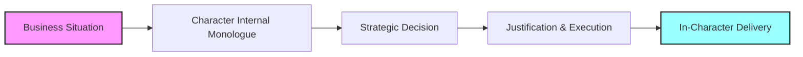

# 🏰 Moff Tarkin: Character-Based Strategic Decision-Making AI

> *"The regional governors now have direct control over their territories. Fear will keep the local systems in line."*
> — Grand Moff Tarkin

## 🎯 Project Vision

**Moff Tarkin** is an experimental RL-based framework for training AI models to embody the strategic thinking patterns of fictional masterminds. Unlike traditional dialogue replication, this project captures complete **thought processes** — the internal monologue, strategic reasoning, and decision-making patterns that make these characters compelling leaders.

### The Goal
Create AI models that provide strategic business advice through distinct character lenses, offering:
- **Corporate Strategy** (Tywin Lannister's ruthless pragmatism)
- **Legal/Ethical Navigation** (Chuck McGill's principled rigidity)
- **Operational Excellence** (General Partagaz's methodical precision)

---

## 🧠 Core Innovation: Beyond Dialogue Replication



### Traditional Approach vs. Moff Tarkin

| Traditional Character AI | Moff Tarkin Framework |
|-------------------------|------------------------|
| ✗ Surface-level dialogue mimicry | ✓ Deep cognitive pattern modeling |
| ✗ Generic responses with character flavor | ✓ Authentic decision-making processes |
| ✗ Single reward function | ✓ Character-specific reward landscapes |
| ✗ Static character selection | ✓ Dynamic MoE routing based on context |

---

## 🏗️ Architecture Overview

### Mixture-of-Experts (MoE) with Learnable Routing

```
┌─────────────────────────────────────────────┐
│            Input: Business Scenario         │
└─────────────────┬───────────────────────────┘
                  │
        ┌─────────▼─────────┐
        │  Learned Router   │
        │ (Context-Aware)   │
        └─────────┬─────────┘
                  │
    ┌─────────────┼─────────────┐
    ▼             ▼             ▼
┌─────────┐ ┌─────────┐ ┌─────────┐
│ Expert 1│ │ Expert 2│ │ Expert 3│
│  Tywin  │ │  Chuck  │ │Partagaz │
└─────────┘ └─────────┘ └─────────┘
    │             │             │
    └─────────────┼─────────────┘
                  ▼
        ┌──────────────────┐
        │ Weighted Output  │
        │  (Multi-Expert)  │
        └──────────────────┘
```

### Key Architectural Decisions

- **Learnable Routers**: Model determines expert activation patterns (not manual assignment)
- **Multi-Expert Activation**: Multiple experts contribute per forward pass
- **GRPO-Based Training**: Constitutional AI with character-specific constraints
- **Character-Specific Rewards**: Different optimization landscapes per expert

---

## 📊 Training Pipeline

### 1. Dataset Structure: Decision Traces

```json
{
  "situation": "Competitor launching aggressive price war threatening 30% market share",
  "internal_monologue": "They mistake aggression for strength. A direct counter-attack would deplete resources on both sides. Better to let them overextend while we fortify our premium segment...",
  "decision": "Maintain premium pricing, enhance value proposition, let competitor burn capital on low-margin customers",
  "justification": "Market leadership isn't about having the most customers, but the right ones. Let them feast on scraps while we dine at the high table.",
  "character": "tywin_lannister",
  "decision_category": "competitive_strategy"
}
```

### 2. Constitutional Character Specifications

```yaml
tywin_lannister:
  core_principles:
    - "Legacy and reputation supersede short-term gains"
    - "Power is influence, not mere authority"
    - "Emotional decisions are weaknesses to exploit"
  decision_patterns:
    - Evaluates multi-generational impact
    - Leverages others' emotional investments
    - Creates dependency relationships
  forbidden_behaviors:
    - Public displays of weakness
    - Decisions driven by sentiment
    - Accepting suboptimal outcomes
```

### 3. Reward Function Design

```python
# Character-specific reward components
reward_tywin = (
    0.3 * strategic_depth +
    0.3 * power_consolidation +
    0.2 * resource_efficiency +
    0.2 * legacy_building
)

reward_chuck = (
    0.4 * ethical_consistency +
    0.3 * procedural_correctness +
    0.2 * logical_rigor +
    0.1 * institutional_preservation
)

reward_partagaz = (
    0.4 * operational_precision +
    0.3 * systemic_control +
    0.2 * intelligence_gathering +
    0.1 * hierarchical_respect
)
```

---

## 🎭 Character Profiles

### Tywin Lannister
*The Calculating Patriarch*

**Strengths:**
- Long-term strategic thinking
- Resource optimization
- Power dynamics mastery

**Use Cases:**
- M&A strategy
- Succession planning
- Competitive positioning

```
"A lion doesn't concern himself with the opinions of sheep."
```

### Chuck McGill
*The Principled Perfectionist*

**Strengths:**
- Legal/regulatory navigation
- Risk assessment
- Process optimization

**Use Cases:**
- Compliance strategy
- Contract negotiations
- Governance frameworks

```
"The law is sacred! If you abuse that power, people get hurt."
```

### General Partagaz (ISB)
*The Methodical Enforcer*

**Strengths:**
- Operational excellence
- Intelligence analysis
- Systematic control

**Use Cases:**
- Security protocols
- Performance monitoring
- Crisis management

```
"Order must be imposed, or it will impose itself."
```

---

## 🔬 Evaluation Framework

### LLM-as-Judge with Character Behavioral Specs

```python
evaluation_prompt = f"""
Evaluate this decision against {character_name}'s established patterns:

Decision: {model_output}
Situation: {test_scenario}

Score on:
1. Character Authenticity (0-10): Does this feel like {character_name}?
2. Strategic Coherence (0-10): Is the reasoning sound?
3. Practical Viability (0-10): Would this work in reality?
4. Internal Consistency (0-10): Does thought process align with decision?
"""
```

### Metrics Dashboard

| Metric | Description | Target |
|--------|-------------|--------|
| Character Consistency | Adherence to character specs | >85% |
| Decision Quality | Business viability score | >7.5/10 |
| Reasoning Depth | Thought process complexity | >3 levels |
| Cross-Character Differentiation | Decision variance between characters | >60% |

---

## 🚀 Implementation Roadmap

### Phase 1: Data Collection & Preparation ✅
- [x] Scene extraction pipeline (80 scenes collected)
- [x] Character dialogue database
- [ ] Decision trace generation from scenes
- [ ] Synthetic situation augmentation

### Phase 2: Base Model Training 🔄
- [ ] Constitutional AI specification
- [ ] GRPO implementation
- [ ] Character-specific reward functions
- [ ] Initial training runs

### Phase 3: MoE Integration 📋
- [ ] Router architecture design
- [ ] Multi-expert training pipeline
- [ ] Dynamic weighting mechanisms
- [ ] Interference mitigation strategies

### Phase 4: Evaluation & Refinement 📋
- [ ] LLM judge implementation
- [ ] A/B testing framework
- [ ] Human evaluation studies
- [ ] Production deployment prep

---

## 💾 Current Data Status

| Character | Scenes Collected | Decision Traces | Training Ready |
|-----------|-----------------|-----------------|----------------|
| Tywin Lannister | 0 | 0 | ❌ |
| Chuck McGill | 52 | 0 | 🔄 |
| General Partagaz | 8 | 0 | 🔄 |
| Logan Roy* | 20 | 0 | 🔄 |

*Potential addition to character roster

---

## 🛠️ Technical Stack

### Training Infrastructure
- **Framework**: PyTorch + Transformers
- **RL Library**: TRL (Transformer Reinforcement Learning)
- **Base Models**: Llama-3.1, Mistral-7B candidates
- **Compute**: A100 GPUs (distributed training)

### Data Pipeline
- **Storage**: SQLite for scenes, Parquet for traces
- **Processing**: Apache Beam for ETL
- **Versioning**: DVC for dataset management

---

## 📦 Installation

```bash
# Clone repository
git clone https://github.com/yourusername/moff-tarkin.git
cd moff-tarkin

# Create virtual environment
python -m venv venv
source venv/bin/activate  # On Windows: venv\Scripts\activate

# Install dependencies
pip install -r requirements.txt

# Download base model weights
python scripts/download_models.py

# Initialize database
python scripts/init_db.py
```

---

## 🎮 Usage Examples

### Basic Decision Request

```python
from moff_tarkin import StrategicAdvisor

advisor = StrategicAdvisor()

situation = """
Our main product line is facing disruption from a tech startup
offering a cheaper alternative. They've secured $50M in funding
and are aggressively targeting our enterprise customers.
"""

response = advisor.get_advice(
    situation=situation,
    context="B2B SaaS, 60% market share, strong brand"
)

print(response.character)  # "tywin_lannister"
print(response.decision)   # Strategic recommendation
print(response.reasoning)  # Internal thought process
```

### Force Character Selection

```python
response = advisor.get_advice(
    situation=situation,
    character="chuck_mcgill",  # Force specific character
    include_monologue=True
)
```

---

## 🧪 Key Technical Challenges

### 1. Router Learning
- **Challenge**: Avoiding manual expert assignment while maintaining character distinction
- **Approach**: Contrastive learning during router pre-training

### 2. Character Interference
- **Challenge**: Preventing character traits from bleeding across experts
- **Approach**: Orthogonal weight initialization + regularization

### 3. Context Length Management
- **Challenge**: Decision traces with full context exceed typical limits
- **Approach**: Hierarchical encoding with attention pooling

### 4. Reward Function Balance
- **Challenge**: Character authenticity vs. business practicality
- **Approach**: Multi-objective optimization with Pareto frontiers

---

## 🔬 Research Questions

1. **Can learned routers discover character-appropriate contexts better than rules?**
2. **How much character-specific data is needed for authentic reasoning patterns?**
3. **Can synthetic decision traces maintain character consistency?**
4. **What's the optimal expert activation pattern (sparse vs. dense)?**

---

## 📈 Future Enhancements

### Near-term
- [ ] Add more characters (Gus Fring, Thomas Shelby, Cersei Lannister)
- [ ] Interactive web interface for decision consultation
- [ ] Fine-grained routing based on decision categories

### Long-term
- [ ] Multi-turn strategic planning sessions
- [ ] Character negotiation simulations
- [ ] Adversarial character interactions
- [ ] Domain-specific fine-tuning (finance, tech, healthcare)

---

## 🤝 Contributing

We welcome contributions! See [CONTRIBUTING.md](CONTRIBUTING.md) for guidelines.

### Priority Areas
- Decision trace generation algorithms
- Character specification refinement
- Evaluation metric development
- Additional character profiles

---

## 📚 References

### Papers
- [Constitutional AI: Harmlessness from AI Feedback](https://arxiv.org/abs/2212.08073)
- [Mixture of Experts Meets Instruction Tuning](https://arxiv.org/abs/2305.06141)
- [GRPO: Group Relative Policy Optimization](https://arxiv.org/abs/2402.03530)

### Frameworks
- [TRL - Transformer Reinforcement Learning](https://github.com/huggingface/trl)
- [DSPy - Stanford NLP](https://github.com/stanfordnlp/dspy)

---

## 📄 License

MIT License - See [LICENSE](LICENSE) file for details.

---

## 🙏 Acknowledgments

- Character creators: George R.R. Martin, Vince Gilligan, Tony Gilroy
- Open source ML community
- Hugging Face for model hosting and tools

---

*"Power is a curious thing. Three great men, a king, a priest, and a rich man. Between them stands a common sellsword. Each great man bids the sellsword kill the other two. Who lives, who dies?"* — Varys

**The answer depends on who the sellsword believes has power. This project aims to capture that belief system.**